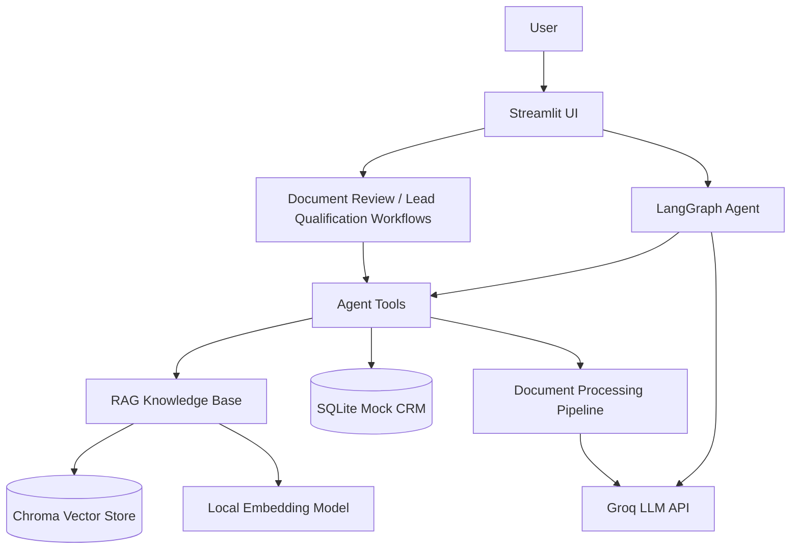

# FinAssist AI

**This project is a portfolio demonstration using entirely synthetic financial data. It is not a production financial system and does not provide financial advice.**

> Portfolio Demonstration — Synthetic Data Only — Human Review Required

FinAssist AI is an AI-powered financial operations agent built for a fictional financial advisory company. It's a working demonstration of a *practical* AI agent — one wired into real business workflows (document review, lead qualification, follow-up automation) via tool-calling, retrieval-augmented generation, and a persistent CRM, rather than a wrapper around a chat endpoint.

## Problem Statement

Financial advisory operations teams spend a lot of time on repetitive, structured work: answering the same onboarding questions, checking whether a client's paperwork is complete, triaging new leads, and drafting routine follow-up emails. FinAssist AI demonstrates how an AI agent can take a first pass at all of this — grounded in real company policy, backed by a real (mock) database, and always leaving the final decision and any outbound communication to a human.

## Features

- **Conversational AI assistant** with tool-calling — looks up clients/leads, reviews documents, checks onboarding status, and creates follow-ups, all from natural-language requests
- **RAG knowledge base** over 12 internal policy documents, with cited sources and no invented answers
- **Document analysis pipeline** — PDF upload → text extraction → structured field extraction → Pydantic validation → AI summary → CRM storage
- **Client document-review workflow** — checks a client's documents against the onboarding checklist and reports exactly what's missing
- **Lead qualification workflow** — transparent, rule-based High/Medium/Low priority scoring with a documented rationale
- **Follow-up automation with a human-approval gate** — every drafted email starts as a `Draft` and can only be marked sent after explicit human approval; nothing is ever sent automatically
- **Full audit trail** — every tool call the agent or a workflow makes is logged and viewable in the AI Actions page
- **Mock CRM** — SQLite-backed clients, leads, documents, tasks, and follow-ups, browsable in the dashboard

## Architecture



## Technology Stack

| Layer | Technology |
|---|---|
| Frontend | Streamlit (`st.navigation` custom multipage app) |
| Agent | LangGraph + LangChain tool-calling |
| LLM | Groq (`openai/gpt-oss-120b`) — free tier |
| Embeddings | `sentence-transformers` (`all-MiniLM-L6-v2`), local, no API key |
| Vector store | ChromaDB (persistent, local) |
| Document processing | PyMuPDF + Pydantic |
| Database | SQLite + SQLAlchemy |
| Synthetic data | Faker + ReportLab |
| Testing | pytest |

This project deliberately runs on a **free stack**: local embeddings mean the RAG pipeline costs nothing and works offline; Groq's free tier covers the LLM calls with no credit card required.

## RAG Workflow

```
knowledge_base/*.md  →  header-aware chunking  →  local embeddings  →  Chroma
                                                                          │
User question  →  retrieve top-k chunks  →  Groq (grounded, cited)  →  Answer
```

The system prompt instructs the model to answer *only* from retrieved context and to say so plainly when the knowledge base doesn't cover a question, rather than inventing company policy.

## Agent Workflow

```
User message  →  LangGraph agent node (Groq + tool schemas)
                        │
                        ├─ no tool call needed → final answer
                        │
                        └─ tool call(s) → ToolNode executes → back to agent node
                                                                (loops until done)
```

Every agent tool call is logged to the `ai_action_log` table, and conversation history is persisted to SQLite (not an in-memory/opaque checkpoint) so it's visible in the CRM and survives across reruns.

## Document-Processing Workflow

```
PDF upload
   │
   ▼
Text extraction (PyMuPDF)
   │
   ▼
Classification (by document title)
   │
   ▼
Field extraction (regex over "Label: value" lines)
   │
   ▼
Pydantic validation → missing_fields list
   │
   ▼
AI summary (Groq, with a templated fallback if unavailable)
   │
   ▼
Stored in documents / document_extractions
   │
   ▼
Compared against the onboarding checklist → Recommended Next Action
```

## Screenshots

| Dashboard | AI Assistant |
|---|---|
|  |  |

| Client Management | Document Analysis |
|---|---|
|  |  |

## Demo Scenarios

These mirror the project's own test scenarios — try them in the running app:

1. **RAG** — Knowledge Base page: *"What documents are required for client onboarding?"* → a grounded, cited answer.
2. **Document Analysis** — Document Analysis page: upload one of the synthetic PDFs from `data/synthetic/documents/` → structured extraction, AI summary, and an onboarding checklist.
3. **Missing Documents** — AI Assistant: *"Check whether client C1002 has completed onboarding."* → identifies the missing Government-issued ID.
4. **Lead Qualification** — Lead Management page: select a lead and click **Qualify Lead** → a High/Medium/Low priority with documented reasoning.
5. **Follow-up** — AI Assistant: *"Create a follow-up for C1002."* → a task plus a draft email, visible on the Follow-ups page pending human approval.

## Installation

```bash
git clone https://github.com/dua-sattar/finassist-ai.git
cd finassist-ai
python -m venv venv

# Windows
venv\Scripts\activate
# macOS/Linux
source venv/bin/activate

pip install -r requirements.txt
cp .env.example .env   # then fill in GROQ_API_KEY (see below)

python -m database.seed
streamlit run app/streamlit_app.py
```

> **Windows troubleshooting:** if `pip install` fails partway through with an
> `OSError` mentioning `onnxruntime` and a very long file path, Windows Long
> Path support is likely disabled and the clone is nested too deeply (e.g.
> under several layers of synced/temp folders). Either clone to a shorter
> path (e.g. `C:\finassist-ai`) or enable long paths: run
> `reg add HKLM\SYSTEM\CurrentControlSet\Control\FileSystem /v LongPathsEnabled /t REG_DWORD /d 1`
> as Administrator, then reboot. This doesn't affect Streamlit Community
> Cloud, which deploys on Linux.

## Environment Variables

Set these in `.env` for local development (see `.env.example`):

| Variable | Description |
|---|---|
| `GROQ_API_KEY` | **Required** for chat/summaries/agent reasoning. Free, no credit card: [console.groq.com/keys](https://console.groq.com/keys) |
| `GROQ_MODEL` | Defaults to `openai/gpt-oss-120b` |
| `EMBEDDING_MODEL` | Local sentence-transformers model, defaults to `all-MiniLM-L6-v2` (no key needed) |
| `SQLITE_DB_PATH` | Defaults to `./database/finassist.db` |
| `VECTOR_DB_DIR` | Defaults to `./rag/vector_store` |

Without `GROQ_API_KEY`, the app still runs — RAG retrieval, document field extraction, and the CRM all work fully offline. Anything that needs an actual generated response (chat replies, AI summaries, email drafts, KB answers) falls back to a clearly-templated message instead of failing.

## Deployment (Streamlit Community Cloud)

1. Push this repository to your own GitHub account (or fork it).
2. Go to [share.streamlit.io](https://share.streamlit.io) and sign in with GitHub.
3. Click **New app**, select this repository, and set:
   - **Main file path:** `app/streamlit_app.py`
4. Under **Advanced settings → Secrets**, add (in TOML format, *not* as a `.env` file):
   ```toml
   GROQ_API_KEY = "your-groq-key-here"
   GROQ_MODEL = "openai/gpt-oss-120b"
   EMBEDDING_MODEL = "all-MiniLM-L6-v2"
   ```
5. Deploy. The first load will seed the database and download the local embedding model (~80MB) automatically — subsequent loads are fast.

No server, Docker image, or separate API layer is needed — the whole app is one Streamlit process.

## Safety & Limitations

- **Synthetic data only.** All clients, leads, transactions, and documents are fictional, generated by scripts in `data/synthetic/`. No real financial or personal data is used anywhere in this project.
- **Not financial, tax, or legal advice.** The agent is explicitly instructed to redirect any request for real investment, tax, or legal advice to a human advisor.
- **No autonomous sends.** Follow-up emails are always drafted, never sent automatically — a human must explicitly approve a draft (`Draft → Approved`) before it can even be marked as sent, and "sending" itself is simulated (no real email is ever dispatched).
- **Human review is required** for every AI-generated recommendation, status change, or draft communication — this is stated in-app on every page and reinforced in the agent's own system prompt.
- **Lead/document scoring is rule-based and transparent**, not a real risk, suitability, or credit assessment — the exact scoring logic is documented in `agent/workflows.py`.

## Project Structure

```
finassist-ai/
├── app/                  # Streamlit UI (streamlit_app.py, views/, components/)
├── agent/                # LangGraph agent, prompts, memory, workflows
├── tools/                # Typed agent tools (knowledge/CRM/document/task/email)
├── rag/                  # Ingestion, embeddings, vector store, retrieval
├── document_processing/  # PDF parsing, structured extraction, schemas
├── database/              # SQLAlchemy models, CRUD, seeding
├── data/synthetic/        # Generated clients, leads, and PDF documents
├── knowledge_base/        # 12 synthetic company policy documents
├── tests/                  # pytest suite
├── docs/screenshots/       # README screenshots
└── requirements.txt
```

## License

Portfolio project. Feel free to reference the code, but the "FinAssist AI" name and all client/company data are fictional and not for reuse as a real brand.
