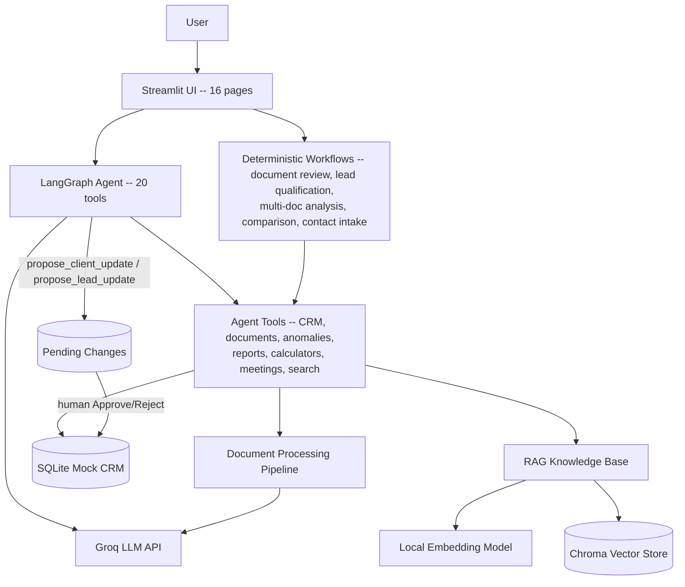
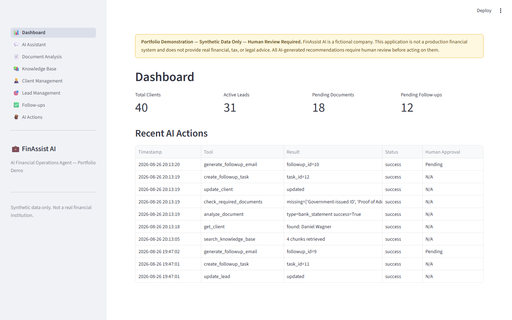
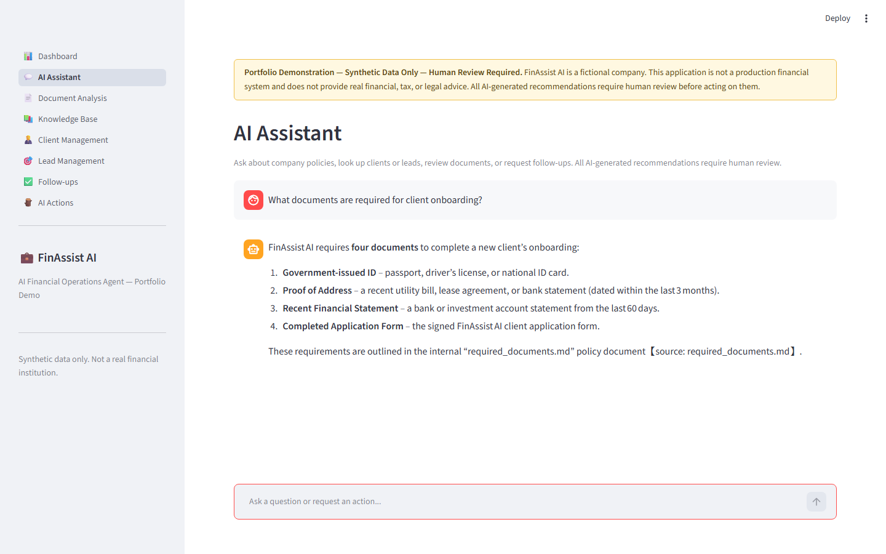
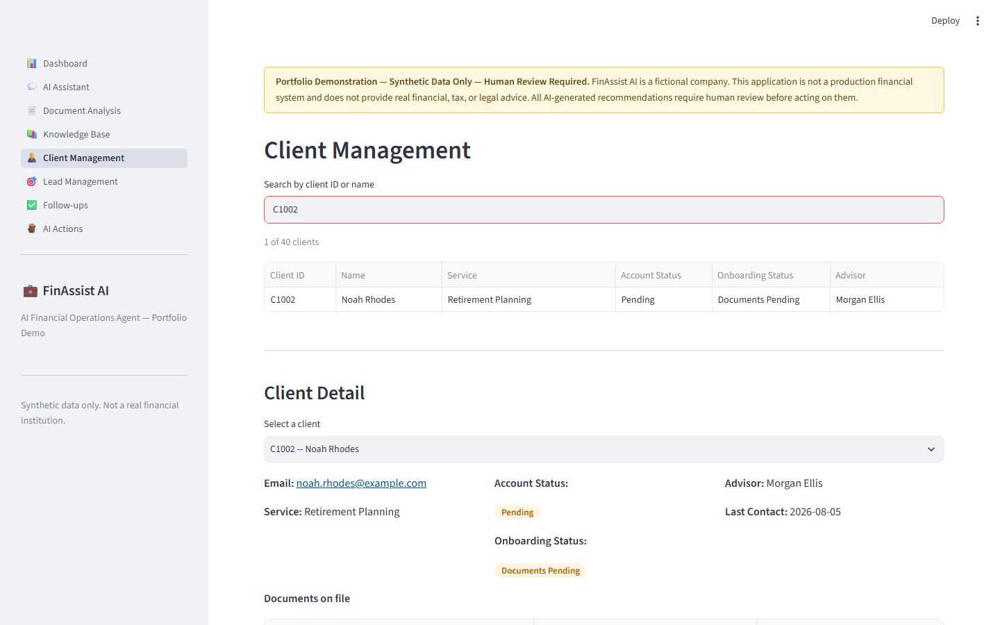
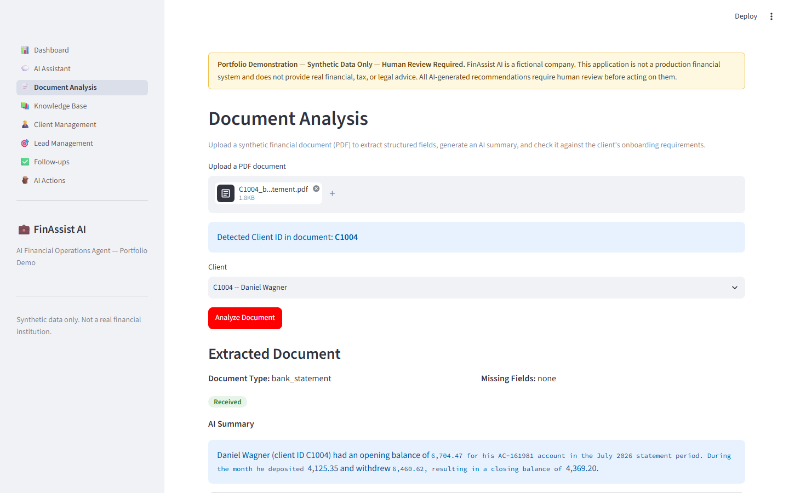

# FinAssist AI

**This project is a portfolio demonstration using entirely synthetic financial data. It is not a production financial system and does not provide financial advice.**

> Portfolio Demonstration — Synthetic Data Only — Human Review Required

FinAssist AI is an AI-powered financial operations *platform* built for a fictional financial advisory company. What started as a chat agent over a document-review workflow has grown into a full operations suite — 16 pages covering document intelligence, CRM automation, lead intake, reporting, and a broader human-approval gate — while staying a working demonstration of a *practical* AI agent: one wired into real business workflows via tool-calling, retrieval-augmented generation, and a persistent CRM, rather than a wrapper around a chat endpoint.

## Problem Statement

Financial advisory operations teams spend a lot of time on repetitive, structured work: answering the same onboarding questions, checking whether a client's paperwork is complete, triaging new leads, and drafting routine follow-up emails. FinAssist AI demonstrates how an AI agent can take a first pass at all of this — grounded in real company policy, backed by a real (mock) database, and always leaving the final decision and any outbound communication to a human.

## Features

**Core AI agent**
- **Conversational AI assistant** with tool-calling over 20 registered tools — looks up/searches clients and leads, reviews documents, checks onboarding status, detects data-quality anomalies, runs financial calculators, drafts follow-ups and meeting summaries, and proposes CRM changes, all from natural-language requests
- **RAG knowledge base** over 12 internal policy documents, with cited sources and no invented answers
- **Persistent agent memory** — conversation history is stored in SQLite (not an opaque in-memory checkpoint), so the agent resolves references like "the statement I mentioned" across turns

**Document intelligence**
- **Document analysis pipeline** — PDF upload → text extraction → structured field extraction → Pydantic validation → AI summary → CRM storage
- **Multi-document analysis** — upload several documents for one client at once; checks onboarding-category coverage and cross-document client ID/name consistency in a single pass
- **Document comparison** — diff two documents field-by-field (e.g. two bank statements from different periods), with numeric deltas and a document-type-mismatch warning
- **Anomaly detection** — scans a client's documents already on file for bank-statement math that doesn't reconcile, negative balances, expired government IDs, and identity mismatches, without requiring a fresh upload

**CRM & lead management**
- **Client & Lead Management** — full profile views, activity feed, and document checklists
- **Lead qualification workflow** — transparent, rule-based High/Medium/Low priority scoring with a documented rationale
- **Contact Us intake** — public-style contact form with AI classification (category/priority/suggested reply) and automatic lead creation for genuine sales inquiries
- **Global Search** — one query across clients, leads, documents, tasks, follow-ups, the knowledge base, and AI-generated summaries
- **AI case summaries** — a formatted per-client overview combining onboarding status, document checklist, recent activity, and an AI-narrated summary
- **AI Action Center** — a prioritized "what needs attention today" digest across open tasks, documents pending, drafts and CRM changes awaiting approval, and new leads
- **Tasks & follow-ups with due dates** — priority-based default due dates and live Overdue/Due Today/Upcoming grouping

**Communication**
- **Email Center** — compose, template-based, or AI-drafted emails, all gated behind human approval before they can be marked sent
- **AI meeting/call summaries** — paste raw notes and get structured Key Points/Decisions/Action Items/Next Steps; action items automatically become follow-up tasks

**Reporting & tools**
- **Reports** — five generated, downloadable (CSV) reports: client portfolio, lead pipeline, document compliance, tasks, and a company-wide anomaly summary
- **Financial calculator** — three deterministic, non-AI calculators (savings growth, loan payment, net worth), each clearly labeled as an illustrative estimate

**Governance & safety**
- **Broader human-approval gate** — the chat agent never applies a client/lead status change directly; it proposes one, and a human must approve or reject it on the Pending Approvals page before it takes effect. Follow-up emails work the same way: every draft starts as `Draft` and can only be marked sent after explicit approval — nothing is ever sent or changed automatically
- **Full audit trail** — every tool call the agent or a workflow makes is logged and viewable on the AI Actions page
- **Mock CRM** — SQLite-backed clients, leads, documents, tasks, follow-ups, meeting summaries, and pending changes, browsable throughout the app

## Architecture



## Technology Stack

| Layer | Technology |
|---|---|
| Frontend | Streamlit (`st.navigation` custom multipage app) |
| Agent | LangGraph + LangChain tool-calling |
| LLM | Groq (`openai/gpt-oss-120b`) — free tier |
| Embeddings | `sentence-transformers` (`all-MiniLM-L6-v2`), local, no API key |
| Vector store | ChromaDB (persistent, local) |
| Document processing | PyMuPDF + Pydantic |
| Database | SQLite + SQLAlchemy |
| Synthetic data | Faker + ReportLab |
| Testing | pytest |

This project deliberately runs on a **free stack**: local embeddings mean the RAG pipeline costs nothing and works offline; Groq's free tier covers the LLM calls with no credit card required.

## RAG Workflow

```
knowledge_base/*.md  →  header-aware chunking  →  local embeddings  →  Chroma
                                                                          │
User question  →  retrieve top-k chunks  →  Groq (grounded, cited)  →  Answer
```

The system prompt instructs the model to answer *only* from retrieved context and to say so plainly when the knowledge base doesn't cover a question, rather than inventing company policy.

## Agent Workflow

```
User message  →  LangGraph agent node (Groq + tool schemas)
                        │
                        ├─ no tool call needed → final answer
                        │
                        └─ tool call(s) → ToolNode executes → back to agent node
                                                                (loops until done)
```

Every agent tool call is logged to the `ai_action_log` table, and conversation history is persisted to SQLite (not an in-memory/opaque checkpoint) so it's visible in the CRM and survives across reruns.

**The human-approval gate.** Most agent tools are read-only or additive (lookups, search, task creation, drafting). The two tools that would otherwise mutate a client or lead record directly — `propose_client_update` / `propose_lead_update` — never apply their change immediately. They create a row in `pending_changes` instead, and the change only reaches the real `clients`/`leads` table once a human clicks **Approve** on the Pending Approvals page. Reject leaves the record untouched, and a change can't be decided twice. The deterministic workflows (document review, lead qualification) are the one exception: since those already run only when a human clicks a dedicated button, that click *is* the human-in-the-loop step, so they keep applying their result immediately rather than adding a second, redundant approval click.

## Document-Processing Workflow

```
PDF upload
   │
   ▼
Text extraction (PyMuPDF)
   │
   ▼
Classification (by document title)
   │
   ▼
Field extraction (regex over "Label: value" lines)
   │
   ▼
Pydantic validation → missing_fields list
   │
   ▼
AI summary (Groq, with a templated fallback if unavailable)
   │
   ▼
Stored in documents / document_extractions
   │
   ▼
Compared against the onboarding checklist → Recommended Next Action
```

## Pages

| Page | Purpose |
|---|---|
| Dashboard | Portfolio-wide metrics: clients, leads, documents pending, follow-ups |
| AI Action Center | Prioritized "what needs attention today" digest |
| AI Assistant | Conversational agent with full tool-calling |
| Document Analysis | Single-document upload, multi-document analysis, and document comparison (3 tabs) |
| Knowledge Base | RAG search over company policy documents |
| Global Search | One query across every record type |
| Client Management | Client profiles, documents, tasks, case summaries, anomaly detection |
| Lead Management | Lead list, profiles, and the qualification workflow |
| Tasks & Follow-ups | Open tasks grouped by due date, manual task creation |
| Reports | Five generated, downloadable CSV reports |
| Meeting Summaries | Paste notes → structured AI summary → auto-created tasks |
| Financial Calculator | Savings growth, loan payment, and net worth calculators |
| Pending Approvals | Review and approve/reject AI-proposed CRM changes |
| Email Center | Compose, template, and AI-drafted emails behind an approval gate |
| Contact Us | Public-style intake form with AI classification and lead automation |
| AI Actions | Full historical audit log of every tool call |

## Screenshots

| Dashboard | AI Assistant |
|---|---|
|  |  |

| Client Management | Document Analysis |
|---|---|
|  |  |

## Demo Scenarios

These mirror the project's own test scenarios — try them in the running app:

1. **RAG** — Knowledge Base page: *"What documents are required for client onboarding?"* → a grounded, cited answer.
2. **Document Analysis** — Document Analysis page: upload one of the synthetic PDFs from `data/synthetic/documents/` → structured extraction, AI summary, and an onboarding checklist.
3. **Missing Documents** — AI Assistant: *"Check whether client C1002 has completed onboarding."* → identifies the missing Government-issued ID.
4. **Lead Qualification** — Lead Management page: select a lead and click **Qualify Lead** → a High/Medium/Low priority with documented reasoning.
5. **Follow-up** — AI Assistant: *"Create a follow-up for C1002."* → a task plus a draft email, visible on the Follow-ups page pending human approval.
6. **Anomaly detection** — Client Management page: select client C1001 and click **Check for Anomalies** → flags its government ID as expired, using nothing but the client's documents already on file.
7. **Human-approval gate** — AI Assistant: *"Update client C1002's account status to Closed."* → the agent creates a pending change and tells you it's awaiting approval, not done; approve or reject it on the Pending Approvals page.
8. **Meeting summary** — Meeting Summaries page: paste a few sentences of call notes → structured Key Points/Decisions/Action Items/Next Steps, with action items appearing as new tasks on the Follow-ups page.
9. **Reports** — Reports page: generate the **Anomaly Summary Report** → a company-wide scan with an AI overview, downloadable as CSV.

## Installation

```bash
git clone https://github.com/dua-sattar/finassist-ai.git
cd finassist-ai
python -m venv venv

# Windows
venv\Scripts\activate
# macOS/Linux
source venv/bin/activate

pip install -r requirements.txt
cp .env.example .env   # then fill in GROQ_API_KEY (see below)

python -m database.seed
streamlit run app/streamlit_app.py
```

> **Windows troubleshooting:** if `pip install` fails partway through with an
> `OSError` mentioning `onnxruntime` and a very long file path, Windows Long
> Path support is likely disabled and the clone is nested too deeply (e.g.
> under several layers of synced/temp folders). Either clone to a shorter
> path (e.g. `C:\finassist-ai`) or enable long paths: run
> `reg add HKLM\SYSTEM\CurrentControlSet\Control\FileSystem /v LongPathsEnabled /t REG_DWORD /d 1`
> as Administrator, then reboot. This doesn't affect Streamlit Community
> Cloud, which deploys on Linux.

## Running Tests

```bash
pytest
```

135 tests run against an isolated temp SQLite database (never the real `database/finassist.db`), covering the document-processing pipeline, RAG retrieval, every agent tool, both deterministic workflows, and cross-feature integration checks (e.g. an approved CRM change actually shows up in a report, not just the underlying table). Every `tools/` module also has a companion `verify_*.py` script for manual, narrated end-to-end runs against real data — e.g. `python -m tools.verify_anomaly`.

The suite works fully offline without `GROQ_API_KEY` set — every AI-dependent code path has a deterministic fallback, and the tests assert against that fallback behavior rather than requiring a live model response.

## Environment Variables

Set these in `.env` for local development (see `.env.example`):

| Variable | Description |
|---|---|
| `GROQ_API_KEY` | **Required** for chat/summaries/agent reasoning. Free, no credit card: [console.groq.com/keys](https://console.groq.com/keys) |
| `GROQ_MODEL` | Defaults to `openai/gpt-oss-120b` |
| `EMBEDDING_MODEL` | Local sentence-transformers model, defaults to `all-MiniLM-L6-v2` (no key needed) |
| `SQLITE_DB_PATH` | Defaults to `./database/finassist.db` |
| `VECTOR_DB_DIR` | Defaults to `./rag/vector_store` |

Without `GROQ_API_KEY`, the app still runs — RAG retrieval, document field extraction, and the CRM all work fully offline. Anything that needs an actual generated response (chat replies, AI summaries, email drafts, KB answers) falls back to a clearly-templated message instead of failing.

## Deployment (Streamlit Community Cloud)

1. Push this repository to your own GitHub account (or fork it).
2. Go to [share.streamlit.io](https://share.streamlit.io) and sign in with GitHub.
3. Click **New app**, select this repository, and set:
   - **Main file path:** `app/streamlit_app.py`
4. Under **Advanced settings → Secrets**, add (in TOML format, *not* as a `.env` file):
   ```toml
   GROQ_API_KEY = "your-groq-key-here"
   GROQ_MODEL = "openai/gpt-oss-120b"
   EMBEDDING_MODEL = "all-MiniLM-L6-v2"
   ```
5. Deploy. The first load will seed the database and download the local embedding model (~80MB) automatically — subsequent loads are fast.

No server, Docker image, or separate API layer is needed — the whole app is one Streamlit process.

## Safety & Limitations

- **Synthetic data only.** All clients, leads, transactions, and documents are fictional, generated by scripts in `data/synthetic/`. No real financial or personal data is used anywhere in this project.
- **Not financial, tax, or legal advice.** The agent is explicitly instructed to redirect any request for real investment, tax, or legal advice to a human advisor.
- **No autonomous sends.** Follow-up emails are always drafted, never sent automatically — a human must explicitly approve a draft (`Draft → Approved`) before it can even be marked as sent, and "sending" itself is simulated (no real email is ever dispatched).
- **No autonomous CRM changes.** The chat agent can only *propose* a client/lead status change; it's stored as a pending change and only takes effect once a human explicitly approves it on the Pending Approvals page.
- **Human review is required** for every AI-generated recommendation, status change, or draft communication — this is stated in-app on every page and reinforced in the agent's own system prompt.
- **Lead/document scoring is rule-based and transparent**, not a real risk, suitability, or credit assessment — the exact scoring logic is documented in `agent/workflows.py`.
- **The financial calculators are illustrative only.** They use standard, unmodified finance formulas (compound interest, amortization) with no AI involved, and every result says so explicitly.

## Project Structure

```
finassist-ai/
├── app/                  # Streamlit UI (streamlit_app.py, views/, components/)
├── agent/                # LangGraph agent, prompts, memory, workflows
├── tools/                # Typed agent tools (knowledge/CRM/document/task/email/
│                         #   anomaly/report/meeting/calculator/search/contact)
├── rag/                  # Ingestion, embeddings, vector store, retrieval
├── document_processing/  # PDF parsing, structured extraction, schemas
├── database/              # SQLAlchemy models, CRUD, seeding
├── data/synthetic/        # Generated clients, leads, and PDF documents
├── knowledge_base/        # 12 synthetic company policy documents
├── tests/                  # pytest suite
├── docs/screenshots/       # README screenshots
└── requirements.txt
```

## License

Portfolio project. Feel free to reference the code, but the "FinAssist AI" name and all client/company data are fictional and not for reuse as a real brand.
